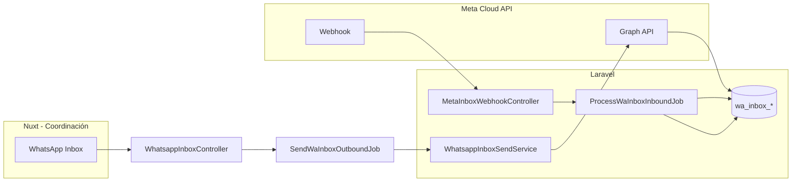
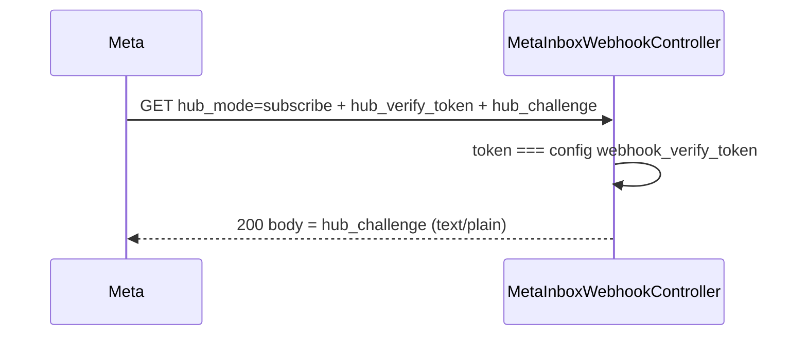
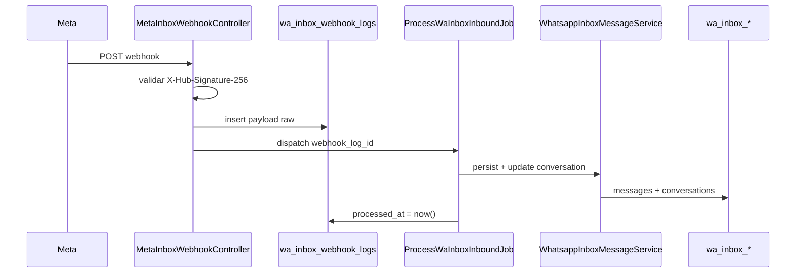
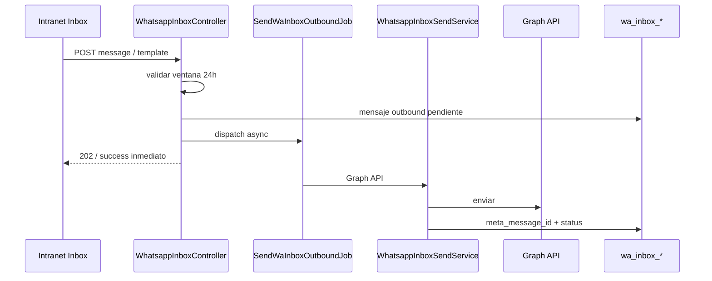

# WhatsApp Inbox — Coordinación (plan de implementación)

Documento de referencia para implementar la vista tipo `probusiness_inbox.html` usando **Meta Cloud API puro**, **tablas nuevas** y rol **Coordinación** únicamente.

**Repos:**

- Frontend: `probusiness_intranetv3`
- Backend: `../probusiness_intranetv2_back`

**Referencia UI:** `probusiness_inbox.html` (mock: sidebar conversaciones, chat, ventana 24h, templates, asignación).

**Arquitectura objetivo (diagrama):** webhook Meta → log raw → cola → persistencia → API intranet → cola envío → Graph.

---

## 1. Decisiones cerradas

| Tema | Decisión |
|------|----------|
| Tablas | Nuevas `wa_inbox_*` — **no** reutilizar `copiloto_conversaciones` ni `whatsapp_messages` |
| Canal | **Meta API puro** (webhook + Graph API) |
| Evolution | **Fuera** del inbox (no webhook, no sync, no `source=evolution`) |
| Rol intranet | Solo **`Coordinación`** |
| Copiloto (ventas) | **Congelado** hasta tener el otro número; luego tablas/módulo propios |
| Asignación | Desde intranet (`assigned_user_id`); filtros operativos; en MVP quien tiene el menú puede escribir en cualquier chat |
| Bitrix histórico | **No** alimenta el inbox; registro outbound en jobs de coordinación puede seguir aparte |

---

## 2. Separación de productos

| Producto | Línea WhatsApp | Tablas | Estado |
|----------|----------------|--------|--------|
| **Inbox coordinación** | Meta `phone_number_id` coordinación | `wa_inbox_*` | Prioridad — implementar primero |
| **Copiloto ventas** | Otro número (futuro) | `wa_copiloto_*` o esquema dedicado ventas | Después |

### Qué hacer con Copiloto hoy (sin borrar DB)

Hoy escriben en tablas legacy:

- `EvolutionWebhookController` → `CopilotoMessageService`
- `CopilotoSyncHistoricoCommand` (Bitrix → copiloto)
- `GET /api/copiloto/*` (`responder` responde 501)

**Acciones al arrancar inbox:**

1. No eliminar migraciones/tablas legacy (histórico de pruebas).
2. Dejar de alimentar tablas copiloto: desactivar o no-op `POST /evolution/webhook` hacia Copiloto; pausar `copiloto:sync-historico` si está en cron.
3. Ocultar menú/rutas `/copiloto` en intranet hasta módulo ventas.
4. Todo código nuevo del inbox solo toca `wa_inbox_*`.

---

## 3. Permisos — rol Coordinación

### Constantes en código

| Capa | Valor |
|------|--------|
| Frontend | `ROLES.COORDINACION` = `'Coordinación'` (`constants/roles.ts`) |
| Backend | `Usuario::ROL_COORDINACION` = `'Coordinación'` |
| Composable | `useUserRole().isCoordinacion` |

### Backend

Archivo: `routes/modules/whatsapp-inbox.php`

```php
Route::group([
    'prefix' => 'whatsapp-inbox',
    'middleware' => ['jwt.auth', /* EnsureCoordinacionRole */],
], function () {
    // ...
});
```

Middleware `EnsureCoordinacionRole` (o equivalente): `$user->getNombreGrupo() === Usuario::ROL_COORDINACION` → si no, **403**.

**Webhook Meta:** sin JWT. **GET:** `hub_verify_token` vs `META_WHATSAPP_WEBHOOK_VERIFY_TOKEN`, responder `hub_challenge`. **POST:** `X-Hub-Signature-256` + `phone_number_id` vs `wa_inbox_sessions`.

**MVP:** no dar acceso a Admin / Jefe Importaciones salvo requisito explícito posterior.

### Frontend

1. Ítem de menú “WhatsApp Inbox” solo para grupo **Coordinación** (panel de acceso / `auth_menu`).
2. Ruta sugerida: `/coordinacion/whatsapp-inbox` o `/whatsapp/inbox`.
3. Middleware de página: `hasRole(ROLES.COORDINACION)`; si falla → `/unauthorized`.
4. `menu-access.global.ts` exige que la ruta esté en `auth_menu` del usuario.

### Escritura

Quien es **Coordinación** y tiene el menú puede: listar, responder, enviar templates, asignar. En MVP **no** restringir “solo el asignado puede escribir”.

---

## 4. Stack: solo Meta (sin Evolution)



### Webhook (entrada)

**Orden en el controller (antes de procesar):**

1. Validar `X-Hub-Signature-256` con `META_WHATSAPP_APP_SECRET` (rechazar 403 si falla).
2. **Insertar** fila en `wa_inbox_webhook_logs` con `payload` JSON crudo (`processed_at` = null).
3. Responder 200 rápido a Meta y encolar `ProcessWaInboxInboundJob` pasando `webhook_log_id`.
4. El job procesa el payload; al terminar OK → `processed_at = now()`. Si falla, el log queda sin procesar para **reproceso manual**.

| Evento | Acción |
|--------|--------|
| `messages` | Persistir mensaje `in`, actualizar cabecera conversación |
| `statuses` | Actualizar `delivery_status` en mensajes salientes |
| Mensaje del cliente | Actualizar `last_customer_message_at` (ventana 24h) |

### Envío (salida desde intranet)

**Siempre asíncrono:** el controller no llama a Graph en el request HTTP. Tras validar ventana y crear mensaje outbound en estado pendiente, encola `SendWaInboxOutboundJob` y responde de inmediato (evita colgar la UI si Meta tarda).

`WhatsappInboxSendService` (ejecutado dentro del job) envuelve lógica de `MetaWhatsAppCoordinacionService`:

| Tipo | Regla Meta |
|------|------------|
| Texto libre | Solo si ventana abierta (< 24h desde último mensaje del cliente) |
| Plantilla | Siempre permitida (también con ventana cerrada) |
| Media | Fase 2 |

### No usar en este módulo

- `EvolutionWebhookController` para inbox
- `CopilotoMessageService` / tablas copiloto
- `CopilotoSyncHistoricoCommand`
- Redis legacy / `WhatsappTrait` para lectura del inbox (envíos masivos existentes pueden seguir en otros flujos)

### Variables de entorno

```env
META_WHATSAPP_COORDINACION_ENABLED=true
META_WHATSAPP_ACCESS_TOKEN=...
META_WHATSAPP_PHONE_NUMBER_ID=...
META_WHATSAPP_APP_SECRET=...          # firma webhook POST X-Hub-Signature-256
META_WHATSAPP_WEBHOOK_VERIFY_TOKEN=pb_inbox_webhook_2026   # Verify Token (GET hub)
META_WHATSAPP_GRAPH_VERSION=v19.0
WA_INBOX_ALERT_PHONE=51999999999      # alerta WhatsApp si failed_jobs del módulo
```

En `config/meta_whatsapp.php` (backend), agregar:

```php
'webhook_verify_token' => env('META_WHATSAPP_WEBHOOK_VERIFY_TOKEN'),
```

Seed de `wa_inbox_sessions` desde `META_WHATSAPP_PHONE_NUMBER_ID` (label: Coordinación).

---

## 5. Base de datos — tablas nuevas

Prefijo: `wa_inbox_`

### 5.1 `wa_inbox_sessions`

Una línea Meta conectada al inbox (MVP: una fila coordinación).

| Campo | Tipo | Notas |
|-------|------|--------|
| `id` | bigint PK | |
| `phone_number_id` | string, unique | Meta |
| `display_number` | string | UI topbar (+51 …) |
| `label` | string | ej. "Coordinación" |
| `is_active` | boolean | |
| `last_webhook_at` | timestamp nullable | |
| `timestamps` | | |

Token/secret: leer de `config/meta_whatsapp.php` o columnas cifradas según política de seguridad del equipo.

### 5.2 `wa_inbox_conversations`

| Campo | Tipo | Notas |
|-------|------|--------|
| `id` | bigint PK | |
| `session_id` | FK → sessions | |
| `wa_contact_id` | string | wa_id Meta |
| `phone_e164` | string, index | |
| `contact_name` | string nullable | |
| `contact_avatar_url` | string nullable | |
| `channel_label` | string | default "Coordinación" |
| `assigned_user_id` | FK users nullable | Asignación intranet |
| `assigned_at` | timestamp nullable | |
| `status` | enum | `open`, `closed`, `archived` |
| `unread_count` | int default 0 | |
| `last_customer_message_at` | timestamp nullable | Ventana 24h |
| `window_expires_at` | timestamp nullable | Calculado o guardado |
| `last_message_preview` | string nullable | Sidebar |
| `last_message_at` | timestamp nullable | |
| `last_direction` | enum nullable | `in`, `out` |
| `timestamps` | | |

**Índices:**

- `unique(session_id, wa_contact_id)` o `(session_id, phone_e164)`
- `(assigned_user_id, last_message_at)`
- `(status, last_message_at)`

**Filtros UI (mock):**

| Filtro | Query |
|--------|--------|
| Todas | sin filtro extra |
| Sin asignar | `assigned_user_id IS NULL` |
| Mis chats | `assigned_user_id = auth()->id()` |
| Cerradas | `status = closed` (definir regla con negocio) |

### 5.3 `wa_inbox_messages`

| Campo | Tipo | Notas |
|-------|------|--------|
| `id` | bigint PK | |
| `conversation_id` | FK | |
| `session_id` | FK | Denormalizado opcional |
| `direction` | enum | `in`, `out` |
| `body` | text nullable | |
| `message_type` | string | `text`, `template`, `image`, `document`, … |
| `template_name` | string nullable | |
| `template_params` | json nullable | |
| `media_url` | string nullable | |
| `media_mime` | string nullable | |
| `meta_message_id` | string unique nullable | Idempotencia webhook |
| `delivery_status` | enum nullable | `sent`, `delivered`, `read`, `failed` |
| `failed_reason` | string nullable | |
| `sent_at` | timestamp, index | |
| `sent_by_user_id` | FK users nullable | Saliente agente |
| `timestamps` | | |

**Índice:** `(conversation_id, sent_at)`

### 5.4 `wa_inbox_webhook_logs` (red de seguridad)

Guardar el **payload crudo** antes de procesar. Si el job falla o hay que auditar/reprocesar, el dato sigue en BD.

| Campo | Tipo | Notas |
|-------|------|--------|
| `id` | bigint PK | |
| `payload` | json | Body completo del webhook Meta |
| `processed_at` | timestamp nullable | `null` = pendiente o falló; timestamp = procesado OK |
| `timestamps` | | |

**Índice:** `(processed_at, created_at)` para listar pendientes de reproceso.

**Flujo:** insert en controller → job lee por `id` → al éxito `processed_at`; comando artisan opcional `wa-inbox:reprocess-webhook-logs` para filas con `processed_at IS NULL`.

### 5.5 Opcional (fases posteriores)

| Tabla | Uso |
|-------|-----|
| `wa_inbox_assignment_log` | Auditoría de asignaciones |
| `wa_inbox_template_cache` | Persistir catálogo además de Redis |

---

## 6. Ventana de conversación 24h (Meta)

Calcular en servidor (`WhatsappInboxConversationService::computeWindowState`):

| Estado | Regla |
|--------|--------|
| `open` | `now - last_customer_message_at` ≤ 24h |
| `warn` | ≤ 1h restante (ej. umbral configurable) |
| `closed` | > 24h sin mensaje del cliente → solo templates |

Respuesta API por conversación:

```json
{
  "window_state": "open",
  "window_expires_at": "2026-06-04T13:42:00Z",
  "window_label": "3h restantes"
}
```

---

## 7. Backend — módulo `WhatsappInbox`

### 7.1 Rutas API (JWT + rol Coordinación)

| Método | Ruta | Descripción |
|--------|------|-------------|
| GET | `/api/whatsapp-inbox/session` | Línea activa (topbar) |
| GET | `/api/whatsapp-inbox/conversations` | Lista + filtros + búsqueda + paginación |
| POST | `/api/whatsapp-inbox/conversations` | Alta manual contacto → `wa_inbox_conversations` |
| GET | `/api/whatsapp-inbox/conversations/{id}/messages` | Historial mensajes |
| POST | `/api/whatsapp-inbox/conversations/{id}/messages` | Texto (ventana abierta) → encola `SendWaInboxOutboundJob` |
| POST | `/api/whatsapp-inbox/conversations/{id}/templates` | Plantilla + parámetros → encola `SendWaInboxOutboundJob` |
| POST | `/api/whatsapp-inbox/conversations/{id}/media` | Fase 2 |
| PATCH | `/api/whatsapp-inbox/conversations/{id}/assign` | `{ "user_id": number }` |
| PATCH | `/api/whatsapp-inbox/conversations/{id}/read` | Marcar leído |
| GET | `/api/whatsapp-inbox/templates` | Catálogo (Redis 1h ← Graph) |
| GET | `/api/whatsapp-inbox/users/assignable` | Opcional: usuarios Coordinación |

Registrar en `routes/api.php`: `require __DIR__.'/modules/whatsapp-inbox.php';`

### 7.2 Webhook (público)

**Misma URL para GET y POST** — Meta distingue por método HTTP.

| Método | Ruta | Descripción |
|--------|------|-------------|
| GET | `/api/webhooks/meta/whatsapp-inbox` | Verificación al suscribir el webhook (hub challenge) |
| POST | `/api/webhooks/meta/whatsapp-inbox` | Validar firma → log raw → encolar job |

Ruta Laravel (sin prefijo duplicado si `api.php` ya aplica `/api`):

```php
Route::match(['get', 'post'], '/webhooks/meta/whatsapp-inbox', [MetaInboxWebhookController::class, 'handle']);
// o GET → verify(), POST → receive()
```

#### 7.2.1 Configuración en Meta (Developer / WhatsApp → Configuration → Webhook)

Al dar de alta el webhook en la app de Meta, completar **dos campos**:

| Campo en Meta | Valor |
|---------------|--------|
| **Callback URL** | `https://{tu-dominio-api}/api/webhooks/meta/whatsapp-inbox` |
| **Verify Token** | String secreto definido por el equipo, ej. `pb_inbox_webhook_2026` |

- El dominio debe ser **HTTPS público** (Meta no llama a localhost sin túnel).
- **Callback URL** = endpoint GET (verificación) + POST (eventos), misma ruta.
- **Verify Token** debe coincidir **exactamente** con `META_WHATSAPP_WEBHOOK_VERIFY_TOKEN` en `.env`.

Tras guardar, Meta hace un **GET** de prueba con query params:

- `hub_mode=subscribe`
- `hub_verify_token={tu verify token}`
- `hub_challenge={número aleatorio}`

El backend debe devolver el **challenge en texto plano** con HTTP 200 si el token coincide; si no, **403**.

#### 7.2.2 `MetaInboxWebhookController::verify` (GET)

```php
public function verify(Request $request)
{
    $mode = $request->query('hub_mode');
    $token = $request->query('hub_verify_token');
    $challenge = $request->query('hub_challenge');

    if ($mode === 'subscribe' && $token === config('meta_whatsapp.webhook_verify_token')) {
        return response($challenge, 200)->header('Content-Type', 'text/plain');
    }

    return response('Forbidden', 403);
}
```

**POST** (`receive` o similar): validar `X-Hub-Signature-256` con `META_WHATSAPP_APP_SECRET` → insert `wa_inbox_webhook_logs` → dispatch `ProcessWaInboxInboundJob` → responder **200** rápido.

| Paso | GET (suscribir) | POST (eventos) |
|------|-----------------|----------------|
| Auth | `hub_verify_token` vs config | HMAC `X-Hub-Signature-256` |
| Respuesta | Body = `hub_challenge` | JSON 200 + procesar en cola |

### 7.3 Controladores

| Clase | Responsabilidad |
|-------|-----------------|
| `MetaInboxWebhookController` | `verify()` GET hub; POST: firma, `wa_inbox_webhook_logs`, dispatch job |
| `WhatsappInboxController` | API intranet delgada |

### 7.4 Servicios

| Servicio | Responsabilidad |
|----------|-----------------|
| `WhatsappInboxConversationService` | Listar, filtros, asignar, ventana 24h, marcar leído |
| `WhatsappInboxMessageService` | Persistir inbound/outbound, listar mensajes |
| `WhatsappInboxSendService` | Enviar texto/template/media vía Graph |
| `WhatsappInboxTemplateService` | Cache Redis 1h + `message_templates` Meta |

### 7.5 Jobs

| Job | Trigger |
|-----|---------|
| `ProcessWaInboxInboundJob` | POST webhook (lee `webhook_log_id`, marca `processed_at`) |
| `SendWaInboxOutboundJob` | **Obligatorio** — POST messages/templates desde intranet (Graph en background) |
| `WaInboxFailedJobsMonitorJob` o comando scheduled | Alerta si hay filas en `failed_jobs` del módulo inbox |

Idempotencia: `meta_message_id` UNIQUE.

### 7.5.1 Alerta `failed_jobs`

Si un job del inbox (`ProcessWaInboxInboundJob`, `SendWaInboxOutboundJob`, etc.) cae a `failed_jobs`, notificar por **WhatsApp a admin** (número/config en `.env`, ej. `WA_INBOX_ALERT_PHONE`).

- Revisión periódica (scheduler cada N minutos) o listener de evento `JobFailed`.
- Mensaje corto: job, excepción, `failed_at`, enlace a Horizon si aplica.
- Incluir en **Sprint A** junto con la cola, para detectar fallos de webhook/envío desde el primer despliegue.

### 7.6 Modelos Eloquent

Namespace sugerido: `App\Models\WhatsappInbox\`

- `WaInboxSession`
- `WaInboxConversation`
- `WaInboxMessage`
- `WaInboxWebhookLog`

---

## 8. Contrato API (ejemplos)

### Conversación (lista)

```json
{
  "id": 1,
  "contact_name": "Haruka",
  "phone_display": "+51 912 705 923",
  "initials": "H",
  "last_message_preview": "Ok gracias!",
  "last_message_at": "2026-06-03T10:42:00Z",
  "unread_count": 3,
  "assigned_user_id": null,
  "assigned_user_name": null,
  "window_state": "open",
  "window_label": "3h restantes",
  "channel_label": "Coordinación",
  "status": "open"
}
```

### Mensaje

```json
{
  "id": 10,
  "direction": "out",
  "body": "Hola…",
  "sent_at": "2026-06-03T10:22:00Z",
  "delivery_status": "read",
  "is_template": true,
  "template_name": "pb_proveedor_llegada_china_v1"
}
```

### Respuesta estándar

Alineada al resto del backend: `{ "success": true, "data": ..., "message": "..." }`.

---

## 9. Frontend (Nuxt)

### 9.1 Estructura de archivos

```
pages/coordinacion/whatsapp-inbox.vue
composables/useWhatsappInbox.ts
services/whatsappInboxService.ts
types/whatsapp-inbox.ts
components/whatsapp-inbox/
  WhatsappInboxSidebar.vue
  WhatsappInboxChatHeader.vue
  WhatsappInboxMessageList.vue
  WhatsappInboxComposer.vue
  WhatsappInboxTemplateModal.vue
```

### 9.2 Arquitectura

- Pages/components **no** llaman `services/*` directo → solo `useWhatsappInbox`.
- Reutilizar: `components/chat/*` (`ChatPanelShell`, `ChatMessagesScroll`, `ChatConversationHeader`, `ChatComposerSimple`).
- Acciones async: `useSpinner` + `useModal` (patrón del proyecto).

### 9.3 UI (mapeo desde mock HTML)

| Zona mock | Componente / comportamiento |
|-----------|----------------------------|
| Topbar número + estado | Session API + indicador conectado |
| Sidebar + búsqueda + filtros | `WhatsappInboxSidebar` |
| Lista conversaciones | API conversations |
| Header + pill ventana + asignar | `WhatsappInboxChatHeader` |
| Burbujas + templates + ticks | `WhatsappInboxMessageList` |
| Composer + banner ventana cerrada | `WhatsappInboxComposer` |
| Modal templates + params | `WhatsappInboxTemplateModal` |

Tema: Nuxt UI + dark mode del intranet (no es obligatorio pixel-perfect del HTML mock).

### 9.4 No usar

- `useCopilotoDashboard`, `CopilotoService`, rutas `/copiloto`
- Evolution / números legacy para este inbox

---

## 10. Flujos

### Entrada (webhook)

### Verificación inicial (GET — al configurar webhook en Meta)



### Eventos entrantes (POST)



### Salida (agente Coordinación)



---

## 11. Plan de sprints

### Sprint A — Esquema + ingesta Meta

- [ ] Migraciones `wa_inbox_sessions`, `wa_inbox_conversations`, `wa_inbox_messages`, **`wa_inbox_webhook_logs`**
- [ ] Modelos `App\Models\WhatsappInbox\*` (incl. `WaInboxWebhookLog`)
- [ ] Seed session coordinación
- [ ] `MetaInboxWebhookController`: **`verify()` GET** (hub challenge) + POST firma → log raw → job → `processed_at`
- [ ] `META_WHATSAPP_WEBHOOK_VERIFY_TOKEN` en `.env` + `config/meta_whatsapp.php`
- [ ] `WhatsappInboxMessageService`
- [ ] **`SendWaInboxOutboundJob`** (async obligatorio desde el primer envío)
- [ ] **Job monitor:** alerta WhatsApp a admin si `failed_jobs` > 0 (jobs del módulo inbox)
- [ ] Desacoplar Evolution → Copiloto (no-op o flag)

### Sprint B — API lectura + UI

- [ ] Middleware rol Coordinación + rutas GET
- [ ] `computeWindowState`
- [ ] Página inbox (lista + chat lectura)
- [ ] Menú intranet solo Coordinación

### Sprint C — Escritura (UI + endpoints; envío async ya en A)

- [ ] `WhatsappInboxSendService` (texto + template; invocado solo desde `SendWaInboxOutboundJob`)
- [ ] POST messages / templates (encolan job, respuesta rápida al cliente)
- [ ] GET templates (cache)
- [ ] Composer + modal + banner ventana cerrada
- [ ] PATCH assign + read + filtros sidebar

### Sprint D — Copiloto ventas (después)

- [ ] Tablas/módulo ventas + número Evolution/Meta ventas
- [ ] Reactivar UI `/copiloto` con línea separada

---

## 12. Checklist Meta / despliegue

### Webhook en Meta Dashboard

- [ ] **Callback URL:** `https://{dominio-producción}/api/webhooks/meta/whatsapp-inbox` (GET + POST, misma URL)
- [ ] **Verify Token** en Meta = mismo valor que `META_WHATSAPP_WEBHOOK_VERIFY_TOKEN` en `.env` (ej. `pb_inbox_webhook_2026`)
- [ ] Tras “Verify and save”, Meta responde OK (GET devuelve `hub_challenge` en texto plano)
- [ ] Suscripciones al webhook: `messages`, `message_status` (statuses)

### Backend / env

- [ ] `META_WHATSAPP_COORDINACION_ENABLED=true`
- [ ] Token y `phone_number_id` de coordinación en `.env`
- [ ] **`META_WHATSAPP_WEBHOOK_VERIFY_TOKEN`** en `.env` (GET hub)
- [ ] **`META_WHATSAPP_APP_SECRET`** en `.env` (POST firma `X-Hub-Signature-256`)
- [ ] **Test verify:** llamada GET manual con `hub_mode=subscribe` + token + challenge
- [ ] **Test de firma POST** con payload real de Meta (o fixture firmado con app secret)
- [ ] Horizon/cola activa para `ProcessWaInboxInboundJob` y `SendWaInboxOutboundJob`
- [ ] `WA_INBOX_ALERT_PHONE` (o equivalente) para alertas por `failed_jobs`
- [ ] Plantillas aprobadas (ver `../probusiness_intranetv2_back/docs/META_WHATSAPP_TEMPLATES.md` y `META_WHATSAPP_TEMPLATES_CUERPO.md`)
- [ ] Ítem menú en panel de acceso para rol **Coordinación**
- [ ] Ocultar `/copiloto` en menú hasta ventas

---

## 13. Referencias en el repo

| Recurso | Ubicación |
|---------|-----------|
| Mock UI | `probusiness_inbox.html` (descargas del usuario) |
| Meta coordinación (envío existente) | `MetaWhatsAppCoordinacionService`, `config/meta_whatsapp.php` |
| Docs Meta | `../probusiness_intranetv2_back/docs/META_WHATSAPP_API.md` |
| Rol front | `constants/roles.ts` → `ROLES.COORDINACION` |
| Rol back | `App\Models\Usuario::ROL_COORDINACION` |
| Chat UI reusable | `components/chat/README.md` |
| Copiloto (congelar) | `routes/modules/copiloto.php`, `EvolutionWebhookController` |

---

*Última actualización del plan: junio 2026 — Meta puro, rol Coordinación, tablas `wa_inbox_*`, webhook logs, verify token GET, envío async obligatorio, alerta failed_jobs.*
